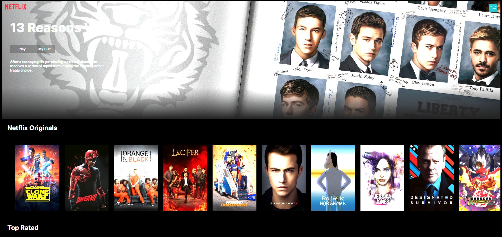

# Netflix のクローンサイト

学習用に実装した Netflix のクローンサイトです。



## 参考にしたサイト

- [【React+TypeScript】Netflixのクローンを作るチュートリアル - Zenn](https://zenn.dev/gunners6518/books/4c4672f32dd100)

## 起動方法

下記を実行してローカルサーバーを立ち上げたのち [http://localhost:3000](http://localhost:3000) をブラウザで開いてください。

```bash
$ npm run dev
```
